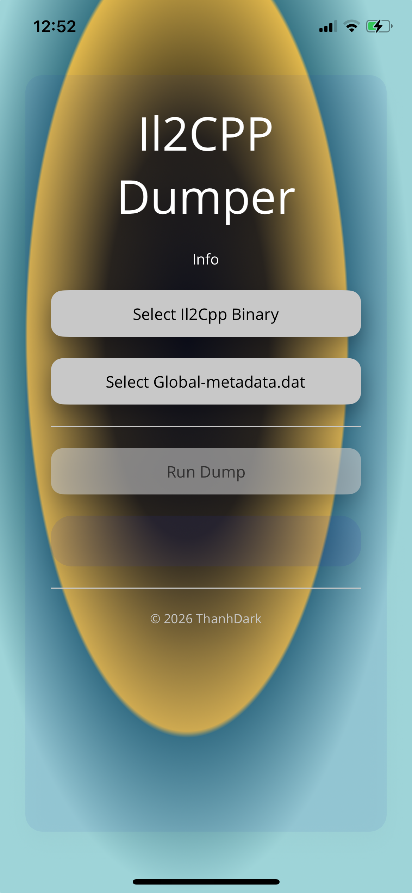
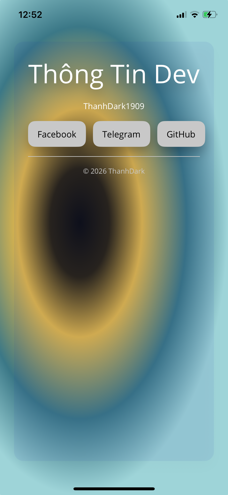
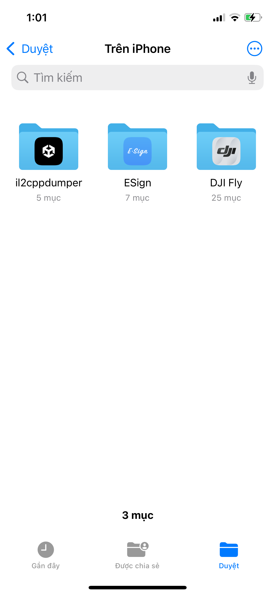

# IL2CPP Dumper – IPA 

## Tải IPA
- IPA được đăng tại mục Releases.
- Tải về máy tính hoặc trực tiếp trên iPhone/iPad.

## Cài đặt IPA
- Sideloadly (Windows/macOS):
  - Kết nối iPhone/iPad, mở Sideloadly.
  - Kéo thả IPA, đăng nhập Apple ID để ký tạm.
  - Nhấn Install.
- AltStore/Scarlet:
  - Cài AltServer, cài AltStore vào iPhone.
  - Mở AltStore/Scarlet, import IPA để cài.
- ESign (trên iPhone):
  - Import IPA, ký bằng chứng chỉ của bạn, sau đó cài.
- TrollStore (không giới hạn):
  - Mở TrollStore, import IPA và cài đặt.

Lưu ý tin cậy chứng chỉ:
- Settings → General → VPN & Device Management → Trust certificate (nếu được yêu cầu).

## Hướng dẫn dùng app
1) Nhấn “Select Il2Cpp Binary” để chọn tập tin Il2Cpp.
2) Nhấn “Select Global-metadata.dat” để chọn metadata.
3) Khi cả hai nút đã hiện tên file, nhấn “Run Dump”.
4) Kết quả được lưu trong thư mục Documents của app (xem bằng Files).

Ảnh minh họa:
- Màn hình chính  

- Trang Thông Tin Dev  

- Thư mục Documents trên iPhone  

